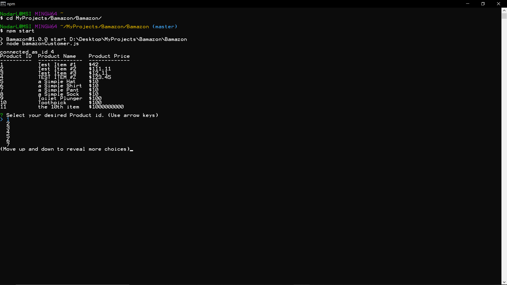
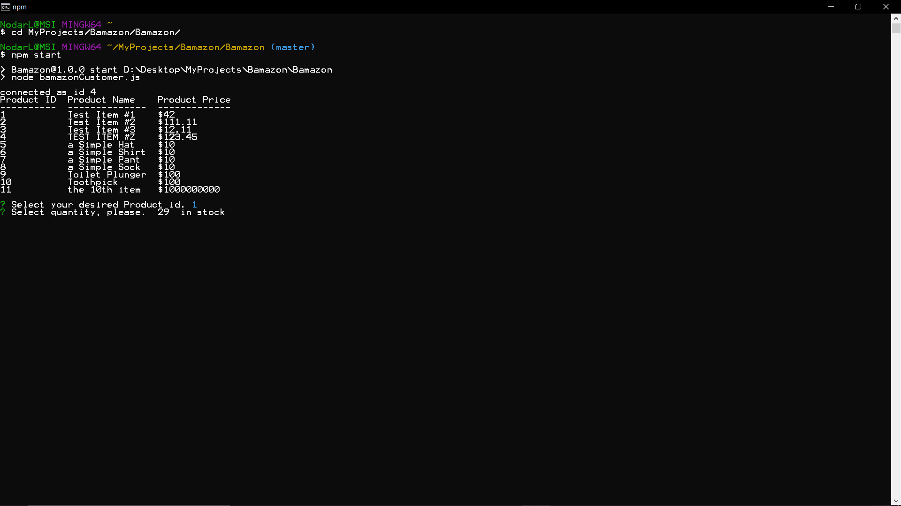
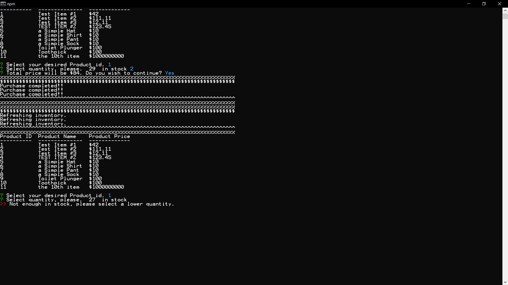
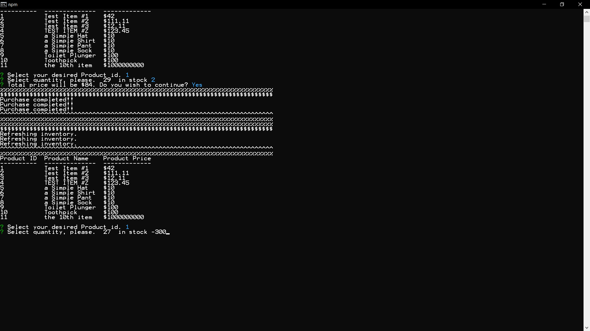
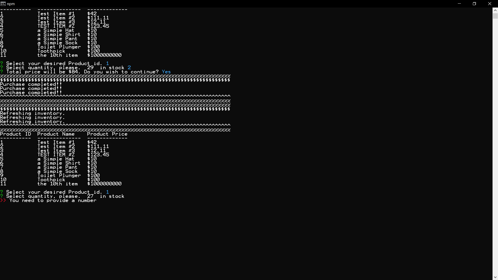
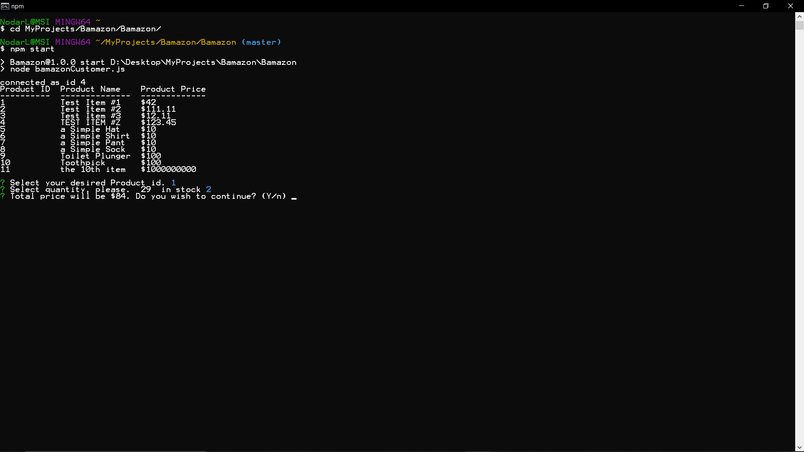
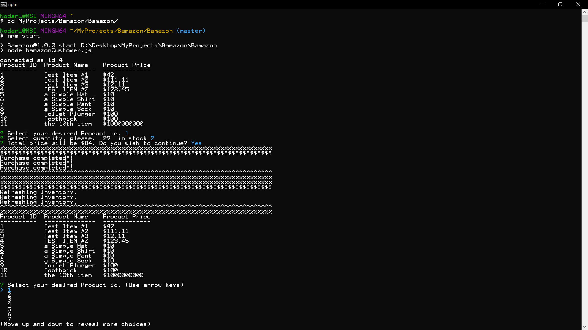

# Bamazon
B+Amazon

A store front app using node.js and mySql.

## Walkthrough

start the app using
    npm start

This displays the current items in stock with their respective prices. 
User has the option of selecting the item id they would like to purchase.

After chosing their desired product, user is told how many is left in stock and then prompted to input quantity.

Input Validation is in effect. Negative numbers dont work (nice try).

Price is confirmed before purchase is completed.

after purchase store front is refreshed.

